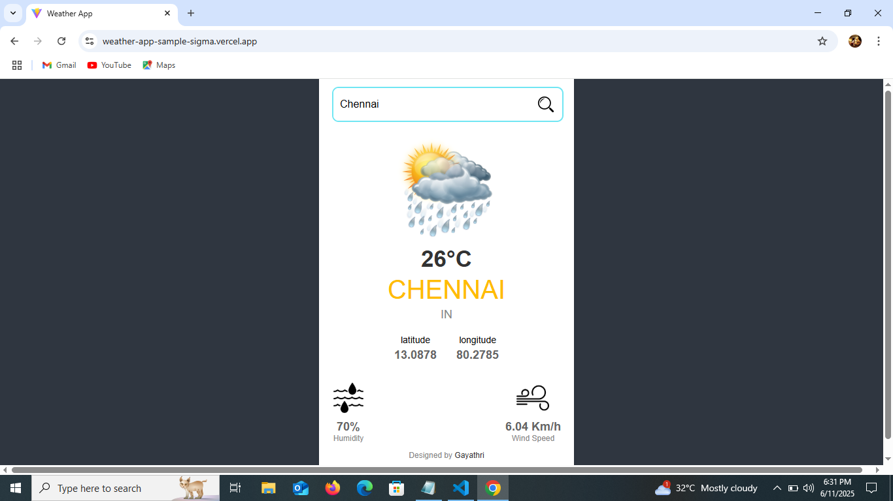
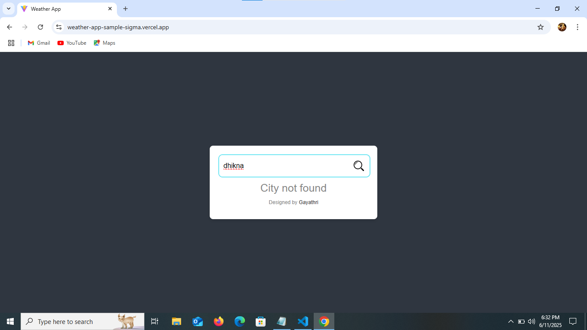

# React Weather App 

A simple and responsive weather application built using React and the OpenWeatherMap API. It displays the current weather based on the searched city.

## Live Demo

🔗 [Live Demo](https://weather-app-sample-sigma.vercel.app/)  

## Developed By  
**Gayathri G**  
GitHub: [GAYATHRI1006](https://github.com/GAYATHRI1006)

## Screenshot





## Features

- Real-time weather updates  
- Shows temperature, humidity, wind speed  
- Displays country, city, coordinates  
- Uses weather icons dynamically  
- Search by city name  
- Loading and error handling  
- Clean and responsive UI  

## Getting Started

### 1. Clone the Repository

```bash
git clone https://github.com/GAYATHRI1006/Digital_Clock_using_React.git
```

### 2. Install Dependencies

```bash
npm install
```

### 3. Run the App

```bash
npm run dev
```

## Tech Stack

- **React**
- **JavaScript**
- **HTML5**
- **CSS3**          
- **OpenWeatherMap API**
